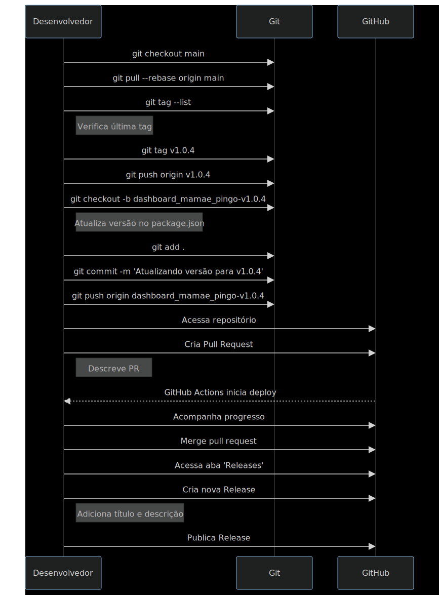

## **Instruções para Deploy**

Esse processo de deploy assume que todo código na branch `main` está pronto para ser enviado para produção. Evitamos o uso de "cherry pick" e nos asseguramos de que toda a versão está consistente. No futuro, poderemos usar essa mesma logica, com algumas alteracoes para suportar deploys com cherry pick.

### **1. Preparação do Ambiente**

**Certifique-se de que você tem a última versão do código:**

```
git checkout main
git pull --rebase origin main
```

### **2. Criação de Tags**

As tags são referências estáticas para pontos específicos no histórico do código. Elas são geralmente usadas para marcar releases.

**a) Primeiro, verifique a última tag:**

```
git tag --list
```

```
# Output:

v1.0.0
v1.0.1
v1.0.2
v1.0.3
(END)
```

O último item da lista representa a tag mais recente. Suponha que seja `v1.0.3`, portanto, nossa próxima versão será `v1.0.4`.

**b) Crie uma nova tag incrementando a versão e publique:**

```# bash
git tag v1.0.4
git push origin v1.0.4
```

### **3. Criação da Branch de Release**

Nessa etapa, você criará uma nova branch que corresponde à versão da tag que você acabou de criar.

**a) Crie a nova branch:**

```# bash
git checkout -b renapsi_biblioteca_digital-v1.0.4
```

**b) Atualize a versão no `package.json` (ou em outros arquivos relevantes se necessário). Certifique-se de alterar a versão conforme sua tag.**

```# package.json
{
	"name":  "react-ts",
	"private":  true,
	"version":  "1.0.3", // Mudar para nova versao
	"type":  "module",
	...
}
```

```# package.json
{
	"name":  "react-ts",
	"private":  true,
	"version":  "1.0.4",
	"type":  "module",
	...
}
```

**c) Adicione e faça commit das mudanças:**

```# bash
git add .
git commit -m "Atualizando versão para v1.0.4"
```

**d) Publique a branch de release:**

```# bash
git push origin renapsi_biblioteca_digital-v1.0.4
```

**e) Crie um Pull Request com essa branch, e faca o deploy para main**

Após publicar a branch de release, crie um pull request para ela. Ao fazer isso, nossa configuração de GitHub Actions identificará automaticamente a nova branch e iniciará o deploy para produção.

### **4. Criação da 'Release' no Github**

**a) Acesse o Repositório no GitHub** Navegue até a página principal do seu repositório no GitHub.

**b) Abra a Aba "Releases"** Localizada na parte superior da página, próxima a "Pull requests".

**c) Inicie uma Nova Release** Clique no botão "Draft a new release".

**d) Selecione a Tag** No campo "Tag version", selecione a tag recentemente criada (ex.: `v1.0.4`). O GitHub automaticamente apontará para a branch correspondente.

**e) Adicione um Título e Descrição** Título: "Release v1.0.4". Descrição: Detalhe alterações, novas características, correções, etc. Informações que possam impactar usuários ou desenvolvedores são essenciais.

**f) (Opcional) Anexe Binários ou Artefatos** Se aplicável, adicione arquivos que deseja distribuir junto à release.

**g) Publique a Release** Clique em "Publish release".

## Fluxograma de deploy:


